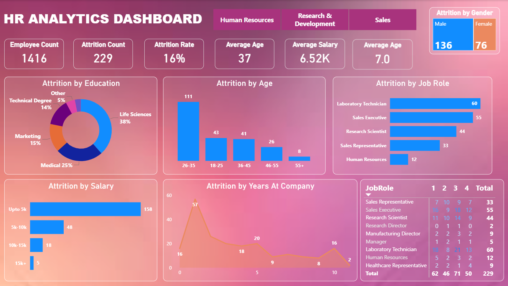

# 📊 HR Analytics Dashboard – Employee Attrition Analysis

## 🔍 Project Overview
This project presents an interactive HR Analytics dashboard built using Power BI to analyze employee attrition and uncover key factors contributing to workforce turnover. The dashboard helps HR and business teams make data-driven decisions to improve employee retention.

---

## 📌 Key Metrics
- **Total Employees:** 1,416  
- **Attrition Count:** 229  
- **Attrition Rate:** 16%  
- **Average Age:** 37  
- **Average Salary:** 6.52K  
- **Average Years at Company:** 7  

---

## 📈 Key Insights
- Highest attrition is observed in the **26–35 age group**
- Employees with salaries **up to 5K** show the highest attrition
- **Laboratory Technicians** and **Sales Executives** face maximum attrition
- Attrition is higher during the **early years of employment**
- **Male attrition** is higher compared to female attrition

---

## 🖼️ Dashboard Preview

---

## 🛠️ Tools & Skills Used
- Power BI  
- Excel (Data Cleaning & Preparation)  
- Power Query  
- DAX (Calculated Measures)  
- Data Visualization  
- HR Analytics  
- Business Analysis  

---

## 📂 Files Included
- `HR_Analytics.pbix` – Power BI source file  
- `hr_analytics_dashboard.png` – Dashboard screenshot

---

## ▶️ How to Use
1. Download the `.pbix` file
2. Open it using **Power BI Desktop**
3. Explore the dashboard using filters and visuals to analyze attrition trends

---

## 🎯 Use Case
This dashboard can help organizations:
- Identify high-risk employee segments
- Understand attrition drivers across age, salary, job role, and tenure
- Support HR strategy and retention planning
